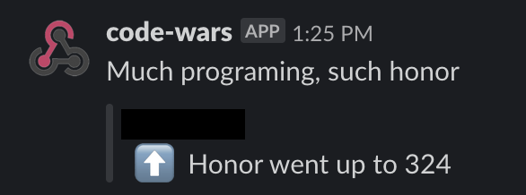

# Codewars webhook receiver

Codewars [webhook receiver](https://dev.codewars.com/#webhooks) server.

Only `honor_changed` events are supported. Events will be forwarded using a slack [incoming webhook](https://api.slack.com/messaging/webhooks).

## Usage

```bash
export PORT=8080
export SLACK_WEBHOOK="https://hooks.slack.com/..."
export SECRET=$(dd if=/dev/urandom bs=30 count=1 2>/dev/null | openssl sha1)

./codewars-webhook
```

Example slack message:



Users will need to setup webhook after deployment in settings: https://www.codewars.com/users/edit